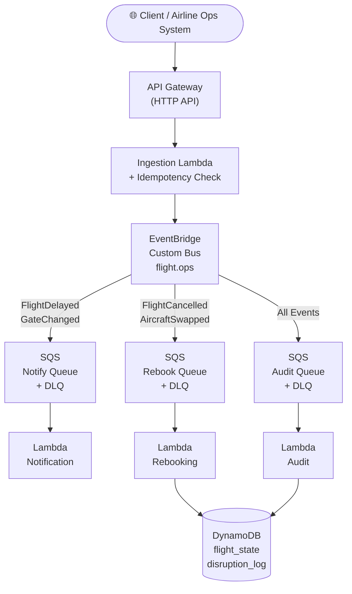
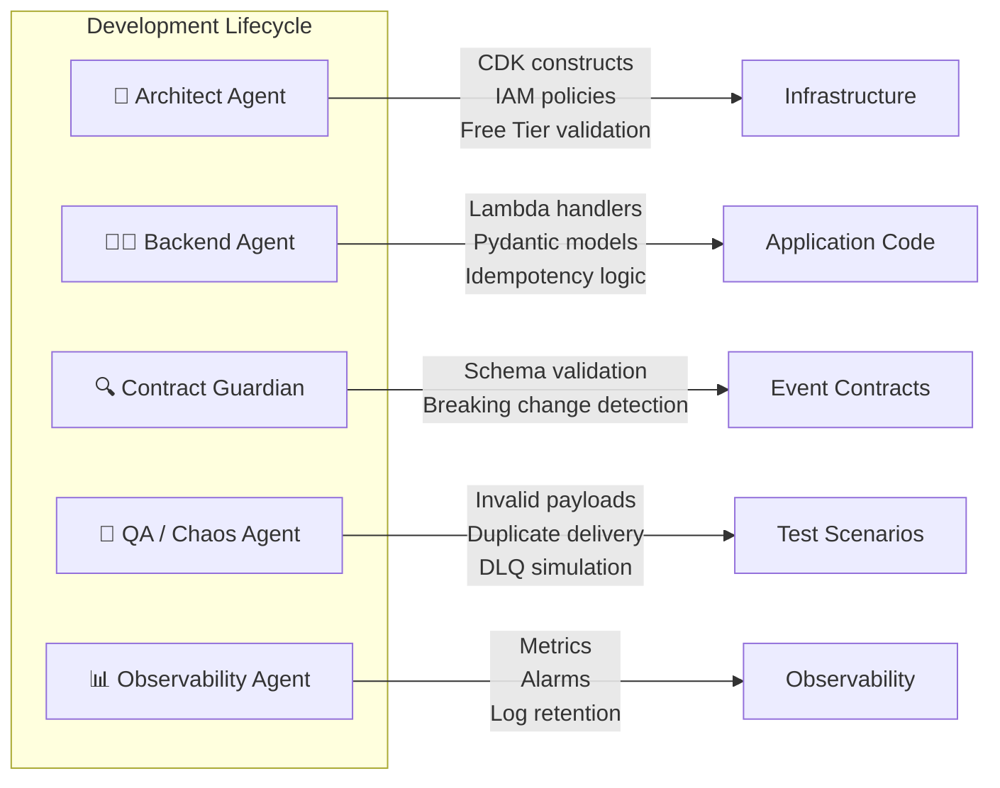
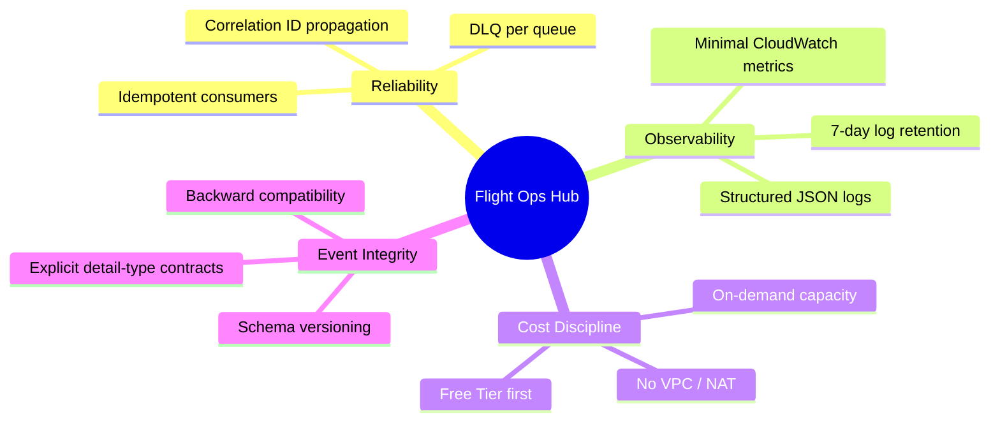
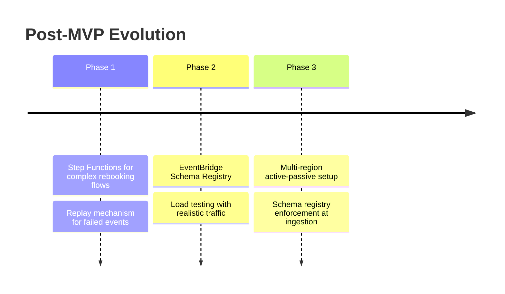

# ✈️ Flight Ops Disruption Hub

> An event-driven airline disruption management system built with Python, AWS CDK, and LLM Agents — designed to stay within the AWS Free Tier.

---

## 🎯 Objective

Build a production-grade, cost-aware system that handles real airline operational disruptions (delays, cancellations, gate changes) using modern cloud-native patterns:

- **Python** — FastAPI + Lambda Powertools
- **AWS CDK (Python)** — Infrastructure as Code
- **EventBridge + SQS + DynamoDB** — Decoupled, resilient messaging
- **LLM Agents** — Accelerate development, validation, documentation, and testing

---

## 🏗️ Architecture Overview



---

## 📡 Event Model

### Core Event Types

| Event Type | Trigger | Primary Consumers |
|---|---|---|
| `FlightDelayed` | Departure pushed > N minutes | Notification, Audit |
| `FlightCancelled` | Flight removed from schedule | Rebooking, Notification, Audit |
| `GateChanged` | Departure gate reassigned | Notification, Audit |
| `AircraftSwapped` | Different aircraft assigned | Rebooking, Audit |

### Event Schema: `FlightDelayed`

All events follow a versioned envelope to support schema evolution without breaking consumers.

```json
{
  "source": "flight.ops",
  "detail-type": "FlightDelayed",
  "detail": {
    "event_id": "550e8400-e29b-41d4-a716-446655440000",
    "schema_version": "1.0",
    "occurred_at": "2026-03-01T10:15:00Z",
    "correlation_id": "7b2f4d90-1234-4abc-9def-000000000001",
    "flight": {
      "airline": "XX",
      "flight_number": "1234",
      "departure_date": "2026-03-01",
      "origin": "MDE",
      "destination": "ATL"
    },
    "delay_minutes": 145,
    "reason_code": "WX"
  }
}
```

> `correlation_id` is propagated end-to-end for distributed tracing. `schema_version` enables backward-compatible evolution.

---

## 🧪 Local Event Testing

> In this project **you are the event producer** — there is no upstream airline system. Use these commands to simulate disruption events after Phase 4 is deployed.
>
> Replace `$API_URL` with the CloudFormation output from `cdk deploy` (e.g. `https://abc123.execute-api.us-east-1.amazonaws.com`).

### FlightDelayed

```bash
curl -X POST "$API_URL/disruptions" \
  -H "Content-Type: application/json" \
  -H "x-correlation-id: 7b2f4d90-1234-4abc-9def-000000000001" \
  -d '{
    "detail-type": "FlightDelayed",
    "detail": {
      "event_id": "550e8400-e29b-41d4-a716-446655440001",
      "schema_version": "1.0",
      "occurred_at": "2026-03-26T10:15:00Z",
      "correlation_id": "7b2f4d90-1234-4abc-9def-000000000001",
      "flight": {
        "airline": "XX",
        "flight_number": "1234",
        "departure_date": "2026-03-26",
        "origin": "MDE",
        "destination": "ATL"
      },
      "delay_minutes": 145,
      "reason_code": "WX"
    }
  }'
```

### FlightCancelled

```bash
curl -X POST "$API_URL/disruptions" \
  -H "Content-Type: application/json" \
  -H "x-correlation-id: 7b2f4d90-1234-4abc-9def-000000000002" \
  -d '{
    "detail-type": "FlightCancelled",
    "detail": {
      "event_id": "550e8400-e29b-41d4-a716-446655440002",
      "schema_version": "1.0",
      "occurred_at": "2026-03-26T11:00:00Z",
      "correlation_id": "7b2f4d90-1234-4abc-9def-000000000002",
      "flight": {
        "airline": "XX",
        "flight_number": "1234",
        "departure_date": "2026-03-26",
        "origin": "MDE",
        "destination": "ATL"
      },
      "reason_code": "MX"
    }
  }'
```

### GateChanged

```bash
curl -X POST "$API_URL/disruptions" \
  -H "Content-Type: application/json" \
  -H "x-correlation-id: 7b2f4d90-1234-4abc-9def-000000000003" \
  -d '{
    "detail-type": "GateChanged",
    "detail": {
      "event_id": "550e8400-e29b-41d4-a716-446655440003",
      "schema_version": "1.0",
      "occurred_at": "2026-03-26T09:30:00Z",
      "correlation_id": "7b2f4d90-1234-4abc-9def-000000000003",
      "flight": {
        "airline": "XX",
        "flight_number": "5678",
        "departure_date": "2026-03-26",
        "origin": "MDE",
        "destination": "JFK"
      },
      "old_gate": "B12",
      "new_gate": "C04"
    }
  }'
```

### AircraftSwapped

```bash
curl -X POST "$API_URL/disruptions" \
  -H "Content-Type: application/json" \
  -H "x-correlation-id: 7b2f4d90-1234-4abc-9def-000000000004" \
  -d '{
    "detail-type": "AircraftSwapped",
    "detail": {
      "event_id": "550e8400-e29b-41d4-a716-446655440004",
      "schema_version": "1.0",
      "occurred_at": "2026-03-26T08:45:00Z",
      "correlation_id": "7b2f4d90-1234-4abc-9def-000000000004",
      "flight": {
        "airline": "XX",
        "flight_number": "9101",
        "departure_date": "2026-03-26",
        "origin": "ATL",
        "destination": "MDE"
      },
      "old_aircraft": "B738",
      "new_aircraft": "A320"
    }
  }'
```

### Idempotency test (re-send same event_id)

```bash
# Re-posting the same event_id should return 202 without re-publishing to EventBridge
curl -X POST "$API_URL/disruptions" \
  -H "Content-Type: application/json" \
  -H "x-correlation-id: 7b2f4d90-1234-4abc-9def-000000000001" \
  -d '{
    "detail-type": "FlightDelayed",
    "detail": {
      "event_id": "550e8400-e29b-41d4-a716-446655440001",
      "schema_version": "1.0",
      "occurred_at": "2026-03-26T10:15:00Z",
      "correlation_id": "7b2f4d90-1234-4abc-9def-000000000001",
      "flight": {
        "airline": "XX",
        "flight_number": "1234",
        "departure_date": "2026-03-26",
        "origin": "MDE",
        "destination": "ATL"
      },
      "delay_minutes": 145,
      "reason_code": "WX"
    }
  }'
```

### Invalid payload test (expect 400)

```bash
curl -X POST "$API_URL/disruptions" \
  -H "Content-Type: application/json" \
  -d '{"detail-type": "FlightDelayed", "detail": {"event_id": "not-a-uuid"}}'
```

---

## 🤖 LLM Agent Strategy

Five specialized agents act as force multipliers throughout the development lifecycle.



### Agent Prompts Reference

<details>
<summary>🧠 Architect Agent</summary>

```
You are a Senior AWS Solutions Architect.
Design a scalable event-driven solution for processing flight disruptions.
Prioritize staying within AWS Free Tier.
Focus on decoupling, resilience, and observability.
Output CDK Python constructs.
```
</details>

<details>
<summary>👨‍💻 Backend Engineer Agent</summary>

```
You are a Senior Python Backend Engineer.
Implement a Lambda handler that validates a FlightDelayed event,
ensures idempotency using DynamoDB, and publishes to EventBridge.
Keep memory and execution time minimal.
```
</details>

<details>
<summary>🔍 Event Contract Guardian</summary>

Validates schema evolution, ensures backward compatibility, prevents breaking changes and payload bloat.
</details>

<details>
<summary>🧪 QA / Chaos Agent</summary>

Generates invalid payloads, simulates duplicate delivery, forces DLQ scenarios, and stress tests within safe Free Tier limits.
</details>

<details>
<summary>📊 Observability Agent</summary>

Defines minimal but useful metrics, keeps CloudWatch retention low, and avoids unnecessary log verbosity.
</details>

---

## 🛠️ Project Structure

```
flight-ops-hub/
│
├── app.py                      # CDK entry point
├── cdk.json                    # CDK configuration
├── requirements.txt
│
├── stacks/
│   ├── api_stack.py            # API Gateway + Ingestion Lambda
│   ├── event_bus_stack.py      # EventBridge bus + rules
│   ├── consumer_stack.py       # SQS queues + consumer Lambdas
│   └── data_stack.py           # DynamoDB tables
│
├── constructs/
│   ├── ingestion_lambda.py     # Reusable ingestion construct
│   ├── disruption_consumer.py  # SQS → Lambda consumer pattern
│   └── dynamodb_tables.py      # Table definitions
│
├── services/
│   ├── ingestion/              # Validate + publish to EventBridge
│   ├── notification/           # Passenger / crew notifications
│   ├── rebooking/              # Rebooking workflow logic
│   └── audit/                  # Persist all events to DynamoDB
│
└── tests/
    ├── unit/
    └── integration/
```

---

## 💰 Free Tier Design

### Services Used

| Service | Free Tier Allowance | Usage in This Project |
|---|---|---|
| AWS Lambda | 1M requests / month | All compute |
| DynamoDB | 25 GB storage, 200M requests | State + audit log |
| SQS | 1M requests / month | 3 queues + 3 DLQs |
| EventBridge | 100k events / month | Custom bus routing |
| API Gateway (HTTP) | 1M calls / month | Ingestion endpoint |
| CloudWatch | Basic logging | Structured logs only |

### Cost Control Practices

- Log retention set to **7 days**
- No provisioned concurrency
- No provisioned DynamoDB capacity (on-demand only)
- No NAT Gateway — avoid VPC for MVP
- Small payloads — no unnecessary metadata
- Throttle test load — no recursive event loops

---

## 🔐 Engineering Principles



---

## 📈 Scaling Roadmap

This is intentionally an MVP. After validating the Free Tier architecture:



---

## 🚀 Learning Outcomes

By completing this project you will deeply understand:

- Event-driven architecture applied to real airline operational scenarios
- Infrastructure as Code with **AWS CDK (Python)**
- Event modeling, versioning, and schema evolution
- **Idempotency patterns** in distributed systems
- Dead Letter Queue (DLQ) strategies and poison message handling
- Observability in serverless architectures
- **Cost-aware architecture design** under Free Tier constraints
- Multi-agent LLM-assisted engineering workflows

---

## 🏁 Vision

> You are building a **mini airline operational backbone** —
> optimized for AWS Free Tier, designed with enterprise architecture patterns,
> and augmented with LLM agents as force multipliers.
>
> This is not a toy project. This is enterprise-grade thinking with startup-level cost discipline.
