# Flight Ops Disruption Hub — Task Spec

> Phased implementation plan. Each task has a clear scope, acceptance criteria, and links to the relevant files.
> Mark tasks with `[x]` as you complete them.

---

## Progress Overview

```mermaid
gantt
    title Implementation Phases
    dateFormat  X
    axisFormat Phase %s

    section Phase 0
    Project Bootstrap         :p0, 0, 1
    section Phase 1
    Event Contracts           :p1, 1, 2
    section Phase 2
    Data Layer                :p2, 2, 3
    section Phase 3
    Event Bus                 :p3, 3, 4
    section Phase 4
    Ingestion API             :p4, 4, 5
    section Phase 5
    Consumer Lambdas          :p5, 5, 6
    section Phase 6
    Observability             :p6, 6, 7
    section Phase 7
    Testing                   :p7, 7, 8
```



---

## Phase 0 — Project Bootstrap

> Goal: runnable CDK app with correct folder structure, no logic yet.

### Task 0.1 — Initialize CDK Python project

- [ ] Run `cdk init app --language python` inside the project root
- [ ] Verify `app.py`, `cdk.json`, and `requirements.txt` are created
- [ ] Replace default `requirements.txt` with project dependencies (see below)
- [ ] Create the virtual environment with `uv venv .venv`
- [ ] Activate it: `.venv\Scripts\activate` (Windows) or `source .venv/bin/activate` (Mac/Linux)
- [ ] Install dependencies: `uv pip install -r requirements.txt`

**`requirements.txt` target:**
```
aws-cdk-lib>=2.100.0
constructs>=10.0.0
aws-lambda-powertools[tracer]>=2.30.0
pydantic>=2.5.0
boto3>=1.34.0
pytest>=8.0.0
pytest-mock>=3.12.0
moto[dynamodb,sqs,events]>=5.0.0
```

**Acceptance criteria:**
- `cdk synth` runs without errors and produces a CloudFormation template
- `.venv/` is excluded via `.gitignore`
- `uv pip list` shows all dependencies installed inside `.venv/`

---

### Task 0.2 — Create folder structure

- [ ] Create all directories as defined in `README.md` (stacks/, constructs/, services/, tests/)
- [ ] Add a `__init__.py` to each Python package directory
- [ ] Add placeholder `handler.py` stubs inside each `services/<domain>/` folder

**Acceptance criteria:**
- All directories exist and are importable Python packages
- `cdk synth` still passes after structure changes

---

### Task 0.3 — Configure `app.py`

- [ ] Instantiate all four stacks: `DataStack`, `EventBusStack`, `ApiStack`, `ConsumerStack`
- [ ] Pass inter-stack dependencies explicitly (e.g., `DataStack` output → `ConsumerStack` input)
- [ ] Tag all stacks with `Project=FlightOpsHub` and `Environment=dev`

**Acceptance criteria:**
- `cdk ls` lists all four stacks
- Stack dependencies are explicit, not implicit

---

## Phase 1 — Event Contracts

> Goal: define and validate the event schema before writing any infrastructure.
> Agent: **Contract Guardian** + **Backend Agent**

### Task 1.1 — Define shared event envelope model

**File:** `services/shared/models.py`

- [ ] Create a `FlightInfo` Pydantic model with fields: `airline`, `flight_number`, `departure_date`, `origin`, `destination`
- [ ] Create a versioned `EventEnvelope` base model with fields: `event_id` (UUID), `schema_version` (str), `occurred_at` (datetime), `correlation_id` (UUID)
- [ ] All fields required — no Optional unless justified

**Acceptance criteria:**
- Models reject invalid UUIDs, bad dates, and missing required fields
- `schema_version` defaults to `"1.0"`

---

### Task 1.2 — Define domain event models

**File:** `services/shared/events.py`

- [ ] `FlightDelayed(EventEnvelope)` — adds `flight: FlightInfo`, `delay_minutes: int`, `reason_code: str`
- [ ] `FlightCancelled(EventEnvelope)` — adds `flight: FlightInfo`, `reason_code: str`
- [ ] `GateChanged(EventEnvelope)` — adds `flight: FlightInfo`, `old_gate: str`, `new_gate: str`
- [ ] `AircraftSwapped(EventEnvelope)` — adds `flight: FlightInfo`, `old_aircraft: str`, `new_aircraft: str`
- [ ] Add a `EVENT_TYPE_MAP: dict[str, type]` mapping `detail-type` strings to their model class

**Acceptance criteria:**
- Each model can be instantiated from the sample JSON in `README.md`
- `model.model_dump_json()` produces a valid, compact JSON string
- Invalid `reason_code` (e.g., empty string) raises `ValidationError`

---

### Task 1.3 — Write unit tests for event models

**File:** `tests/unit/test_models.py`

- [ ] Valid payload → model instantiates correctly
- [ ] Missing required field → `ValidationError` raised
- [ ] Invalid UUID in `event_id` → `ValidationError` raised
- [ ] `delay_minutes` as negative integer → test expected behavior (reject or allow — decide and document)

---

## Phase 2 — Data Layer

> Goal: DynamoDB tables provisioned via CDK, accessible from Lambdas.
> Agent: **Architect Agent**

### Task 2.1 — Define DynamoDB tables construct

**File:** `constructs/dynamodb_tables.py`

- [ ] `flight_state` table — partition key: `flight_id` (String), sort key: `departure_date` (String), on-demand billing
- [ ] `disruption_log` table — partition key: `event_id` (String), on-demand billing, TTL attribute: `expires_at`
- [ ] `idempotency` table — partition key: `id` (String), TTL attribute: `expiration` (used by Lambda Powertools)
- [ ] Set `removal_policy=DESTROY` for dev environment (no orphaned tables on `cdk destroy`)

**Acceptance criteria:**
- `cdk synth` shows all three tables in the template
- Tables use `BillingMode.PAY_PER_REQUEST`
- TTL is enabled on `disruption_log` and `idempotency`

---

### Task 2.2 — Create `DataStack`

**File:** `stacks/data_stack.py`

- [ ] Instantiate the `DynamoDBTables` construct
- [ ] Expose table references as public properties: `self.flight_state_table`, `self.disruption_log_table`, `self.idempotency_table`

**Acceptance criteria:**
- Other stacks can import and reference the tables without circular dependencies

---

## Phase 3 — Event Bus

> Goal: EventBridge custom bus with routing rules and SQS queues with DLQs.
> Agent: **Architect Agent**

### Task 3.1 — Create EventBridge custom bus

**File:** `stacks/event_bus_stack.py`

- [ ] Create a custom EventBus named `flight-ops-bus`
- [ ] Expose the bus as `self.bus` for other stacks to reference

**Acceptance criteria:**
- `cdk synth` shows the custom bus in the template
- Bus name is parameterized (not hardcoded in routing rules)

---

### Task 3.2 — Create SQS queues with DLQs

**File:** `stacks/event_bus_stack.py`

- [ ] Three main queues: `notify-queue`, `rebook-queue`, `audit-queue`
- [ ] Three DLQs: one per main queue, named `<queue>-dlq`
- [ ] `maxReceiveCount=3` on each main queue (after 3 failures → DLQ)
- [ ] Visibility timeout: 30 seconds (≥ Lambda timeout)

**Acceptance criteria:**
- Each main queue has a `deadLetterQueue` configured
- Queue URLs exposed as stack outputs

---

### Task 3.3 — Create EventBridge routing rules

**File:** `stacks/event_bus_stack.py`

Routing logic (from `README.md`):

| Rule | Events matched | Target queue |
|---|---|---|
| `notify-rule` | `FlightDelayed`, `GateChanged` | `notify-queue` |
| `rebook-rule` | `FlightCancelled`, `AircraftSwapped` | `rebook-queue` |
| `audit-rule` | All events (`source: flight.ops`) | `audit-queue` |

- [ ] Implement each rule using `events.Rule` with `event_pattern` filtering on `detail-type`
- [ ] Grant EventBridge permission to send messages to each SQS target
- [ ] `audit-rule` must match all four event types (not a wildcard on `detail-type` — be explicit)

**Acceptance criteria:**
- `cdk synth` shows 3 rules and 3 SQS targets in the template
- IAM policy allows `sqs:SendMessage` from the EventBridge service principal

---

## Phase 4 — Ingestion API

> Goal: HTTP endpoint that validates, deduplicates, and publishes flight disruption events.
> Agent: **Backend Agent** + **Architect Agent**

### Task 4.1 — Ingestion Lambda handler

**File:** `services/ingestion/handler.py`

- [ ] Parse incoming body and validate against the correct event model using `EVENT_TYPE_MAP`
- [ ] Reject unknown `detail-type` values with HTTP 400
- [ ] Use **Lambda Powertools Idempotency** with the `idempotency` DynamoDB table — key: `event_id`
- [ ] Publish validated event to EventBridge custom bus using `boto3`
- [ ] Return HTTP 202 Accepted on success
- [ ] Use **Lambda Powertools Logger** with `correlation_id` injected into every log line

**Acceptance criteria:**
- Duplicate `event_id` within 24h returns 202 without re-publishing to EventBridge
- Invalid payload returns 400 with a structured error body
- All log lines include `correlation_id` and `event_id`

---

### Task 4.2 — Ingestion Lambda CDK construct

**File:** `constructs/ingestion_lambda.py`

- [ ] `aws_lambda.Function` with Python 3.12 runtime
- [ ] Memory: 256 MB, timeout: 10 seconds
- [ ] Environment variables: `EVENT_BUS_NAME`, `IDEMPOTENCY_TABLE_NAME`, `LOG_LEVEL=INFO`
- [ ] IAM grants: `events:PutEvents` on the bus, `dynamodb:PutItem/GetItem` on idempotency table
- [ ] CloudWatch Log Group with 7-day retention

**Acceptance criteria:**
- Lambda can be invoked locally with `cdk watch` / SAM
- No `*` in IAM policies — least-privilege only

---

### Task 4.3 — HTTP API Gateway

**File:** `stacks/api_stack.py`

- [ ] Create `HttpApi` (not REST API)
- [ ] Single route: `POST /disruptions`
- [ ] Integration: Lambda proxy to ingestion Lambda
- [ ] Output the API URL as a CloudFormation output

**Acceptance criteria:**
- `curl -X POST <api-url>/disruptions -d '<valid_payload>'` returns 202
- `curl -X POST <api-url>/disruptions -d '<invalid_payload>'` returns 400

---

## Phase 5 — Consumer Lambdas

> Goal: three independent consumers, each idempotent, processing from their own SQS queue.
> Agent: **Backend Agent**

### Task 5.1 — Reusable consumer CDK construct

**File:** `constructs/disruption_consumer.py`

- [ ] Accepts: `queue`, `handler_code_path`, `environment_vars`, `table_grants` (optional)
- [ ] Creates a Lambda function with SQS event source mapping (`batchSize=1`)
- [ ] Sets Lambda timeout to 25s (under SQS visibility timeout of 30s)
- [ ] CloudWatch Log Group with 7-day retention

**Acceptance criteria:**
- Construct is reusable for all three consumer Lambdas without code duplication

---

### Task 5.2 — Audit Lambda

**File:** `services/audit/handler.py`

- [ ] Parse SQS record body → extract EventBridge event detail
- [ ] Validate against event models
- [ ] Write item to `disruption_log` table: `event_id` (PK), `detail_type`, `flight_number`, `occurred_at`, `raw_detail`, `ttl` (now + 90 days)
- [ ] Use Lambda Powertools Logger + structured log entry per record

**Acceptance criteria:**
- Each processed event appears in `disruption_log` within 5 seconds
- Duplicate event (same `event_id`) does not cause duplicate DB write (conditional write)
- Failed writes land in DLQ after 3 retries

---

### Task 5.3 — Notification Lambda

**File:** `services/notification/handler.py`

- [ ] Parse and validate SQS record
- [ ] Log a structured "notification sent" message with flight details (no actual email/SMS for MVP)
- [ ] Include `correlation_id` in every log line

**Acceptance criteria:**
- Lambda processes `FlightDelayed` and `GateChanged` events without error
- Unrecognized event types are logged as warnings and skipped (no exception)

---

### Task 5.4 — Rebooking Lambda

**File:** `services/rebooking/handler.py`

- [ ] Parse and validate SQS record
- [ ] For `FlightCancelled`: write/update item in `flight_state` table with `status=CANCELLED`
- [ ] For `AircraftSwapped`: write/update item in `flight_state` table with `aircraft=<new_aircraft>`
- [ ] Use DynamoDB `update_item` with condition expression to avoid overwriting newer state

**Acceptance criteria:**
- `flight_state` table reflects correct status after processing
- Out-of-order events (older `occurred_at`) do not overwrite newer state

---

### Task 5.5 — Wire consumers in `ConsumerStack`

**File:** `stacks/consumer_stack.py`

- [ ] Instantiate three `DisruptionConsumer` constructs using the queues from `EventBusStack`
- [ ] Pass correct table references from `DataStack`
- [ ] Grant each Lambda only the permissions it needs (principle of least privilege)

**Acceptance criteria:**
- `cdk synth` shows three Lambda functions, each with correct SQS event source mappings
- No Lambda has write access to a table it doesn't need

---

## Phase 6 — Observability

> Goal: enough visibility to debug issues without blowing up CloudWatch costs.
> Agent: **Observability Agent**

### Task 6.1 — Structured logging standards

- [ ] All Lambdas use `from aws_lambda_powertools import Logger`
- [ ] Logger initialized with `service=<lambda-name>` and `level=INFO`
- [ ] `correlation_id` injected from event context at the start of each handler
- [ ] Log levels: `INFO` for normal flow, `WARNING` for skipped/unexpected, `ERROR` for failures

**Acceptance criteria:**
- Every log line in CloudWatch is valid JSON
- `correlation_id` appears in every log line

---

### Task 6.2 — CloudWatch alarms

- [ ] Alarm: `notify-dlq` message count > 0 → triggers CloudWatch alarm (no action for MVP, just the alarm state)
- [ ] Alarm: `rebook-dlq` message count > 0
- [ ] Alarm: `audit-dlq` message count > 0

**Acceptance criteria:**
- Alarms are visible in CloudWatch console
- Alarm period: 1 minute, evaluation periods: 1

---

## Phase 7 — Testing

> Agent: **QA / Chaos Agent**

### Task 7.1 — Unit tests: ingestion handler

**File:** `tests/unit/test_ingestion_handler.py`

- [ ] Valid `FlightDelayed` payload → EventBridge `put_events` called once, returns 202
- [ ] Unknown `detail-type` → returns 400, EventBridge NOT called
- [ ] Missing required field → returns 400
- [ ] Duplicate `event_id` (idempotency hit) → returns 202, EventBridge NOT called again
- [ ] Use `moto` to mock DynamoDB and EventBridge

---

### Task 7.2 — Unit tests: audit handler

**File:** `tests/unit/test_audit_handler.py`

- [ ] Valid SQS record → item written to `disruption_log`
- [ ] Duplicate `event_id` → second write rejected (conditional expression)
- [ ] Malformed SQS body → exception raised (message goes to DLQ naturally)
- [ ] Use `moto` to mock DynamoDB

---

### Task 7.3 — Unit tests: rebooking handler

**File:** `tests/unit/test_rebooking_handler.py`

- [ ] `FlightCancelled` → `flight_state` updated with `status=CANCELLED`
- [ ] `AircraftSwapped` → `flight_state` updated with new aircraft
- [ ] Out-of-order event (older `occurred_at`) → state NOT updated (condition expression blocks it)

---

### Task 7.4 — Integration smoke test

**File:** `tests/integration/test_smoke.py`

- [ ] POST valid `FlightDelayed` to API Gateway → returns 202
- [ ] Wait 5s → `disruption_log` contains the event
- [ ] POST same payload again → returns 202, no duplicate in `disruption_log`
- [ ] POST invalid payload → returns 400

> Requires a deployed stack. Run with `pytest tests/integration/ --deployed`.

---

## Appendix — Key Design Decisions

| Decision | Choice | Rationale |
|---|---|---|
| API type | HTTP API (not REST API) | Lower cost, sufficient for this use case |
| Idempotency store | DynamoDB via Powertools | Built-in TTL, no extra service needed |
| Consumer batch size | 1 | Simpler error isolation, one failure → one DLQ message |
| DLQ `maxReceiveCount` | 3 | Balance between retry and poison message handling |
| Log retention | 7 days | Free Tier cost control |
| DynamoDB capacity | On-demand | No provisioning, scales to zero |
| Lambda runtime | Python 3.12 | Latest stable, best cold start performance |
| Lambda memory | 256 MB (ingestion), 128 MB (consumers) | Minimal footprint |
